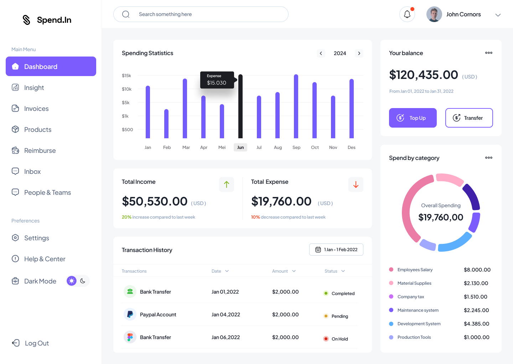

# 🚀 FTC-W2-SALEM - Plateforme de Gestion des Dépenses Business

## 🖼️ Aperçu du Projet



*Interface principale de la plateforme Spend.In - Gestion des dépenses business*

## 📋 Description

**FTC-W2-SALEM** est une application web moderne et responsive construite avec Next.js 15, TypeScript et Tailwind CSS. Cette plateforme simule une solution de gestion des dépenses business appelée "Spend.In", offrant une interface utilisateur intuitive et des animations fluides pour la gestion des finances d'entreprise.

## ✨ Fonctionnalités Principales

### 🎯 Sections de l'Application
- **Hero Section** - Page d'accueil avec navigation et call-to-action
- **Benefits** - Présentation des avantages de la plateforme
- **How It Works** - Processus en 3 étapes pour utiliser la plateforme
- **Success Stories** - Témoignages et études de cas
- **Testimonials** - Avis clients
- **Pricing** - Plans tarifaires
- **CTA Section** - Section d'appel à l'action
- **Footer** - Pied de page avec liens et informations

### 🎨 Caractéristiques Techniques
- **Design Responsive** - Optimisé pour tous les appareils
- **Animations GSAP** - Transitions fluides et effets 3D
- **Parallax Effects** - Effets de profondeur avec react-parallax-tilt
- **Motion Animations** - Animations d'entrée avec Framer Motion
- **Custom Cursor** - Curseur personnalisé pour une meilleure UX
- **Scroll Progress Bar** - Barre de progression du scroll
- **Hamburger Menu** - Menu mobile responsive
- **Image Skeleton Loading** - Chargement progressif des images

## 🛠️ Technologies Utilisées

### Frontend
- **Next.js 15** - Framework React avec App Router
- **React 19** - Bibliothèque UI
- **TypeScript 5** - Typage statique
- **Tailwind CSS 3.4** - Framework CSS utilitaire
- **Framer Motion** - Animations React
- **GSAP** - Animations avancées et 3D

### UI/UX
- **Lucide React** - Icônes modernes
- **React Parallax Tilt** - Effets de parallaxe
- **Lottie React** - Animations vectorielles
- **CLSX** - Gestion conditionnelle des classes CSS

### Intégrations
- **Cal.com Embed** - Intégration de calendrier pour les rendez-vous

## 🚀 Installation

### Prérequis
- Node.js 18+ 
- npm ou yarn

### Étapes d'installation

1. **Cloner le repository**
```bash
git clone [URL_DU_REPO]
cd FTC-W2-SALEM
```

2. **Installer les dépendances**
```bash
npm install
# ou
yarn install
```

3. **Lancer le serveur de développement**
```bash
npm run dev
# ou
yarn dev
```

4. **Ouvrir dans le navigateur**
```
http://localhost:3000
```

## 📁 Structure du Projet

```
📁 FTC-W2-SALEM (Projet Next.js)
├── 📄 Configuration
│   ├── package.json
│   ├── package-lock.json
│   ├── tsconfig.json
│   ├── tailwind.config.js
│   ├── postcss.config.js
│   ├── next.config.ts
│   ├── next-env.d.ts
│   ├── eslint.config.mjs
│   └── .gitignore
├── 📁 public/
│   ├── file.svg
│   ├── globe.svg
│   ├── next.svg
│   ├── vercel.svg
│   └── window.svg
├── 📁 src/
│   ├── 📁 app/
│   │   ├── 📄 page.tsx
│   │   ├── 📄 layout.tsx
│   │   ├── 📄 globals.css
│   │   ├── 📄 favicon.ico
│   │   ├── 📁 components/
│   │   │   ├── 📄 index.tsx
│   │   │   ├── 📁 layout/
│   │   │   │   ├── Hero.tsx
│   │   │   │   ├── Benefits.tsx
│   │   │   │   ├── HowItWorks.tsx
│   │   │   │   ├── Pricing.tsx
│   │   │   │   ├── SuccessStories.tsx
│   │   │   │   ├── Testimonials.tsx
│   │   │   │   ├── CtaSection.tsx
│   │   │   │   └── Footer.tsx
│   │   │   └── 📁 ui/
│   │   │       ├── Button.tsx
│   │   │       ├── Card.tsx
│   │   │       ├── Logo.tsx
│   │   │       ├── Navbar.tsx
│   │   │       ├── HamburgerMenu.tsx
│   │   │       ├── CustomCursor.tsx
│   │   │       ├── ScrollProgressBar.tsx
│   │   │       ├── ImageWithSkeleton.tsx
│   │   │       ├── ArrowDown.tsx
│   │   │       ├── LeftBenefit.tsx
│   │   │       └── LeftSuccessStoris.tsx
│   │   ├── 📁 types/
│   │   │   ├── index.ts
│   │   │   ├── button.ts
│   │   │   ├── card.ts
│   │   │   ├── Benefits.ts
│   │   │   ├── SuccessStories.ts
│   │   │   ├── HamburgerMenu.ts
│   │   │   └── ImageSkeleton.ts
│   │   └── 📁 hooks/
│   └── 📁 assets/
│       └── 📁 images/
│           ├── dashboard.png
│           ├── Dashboard.svg
│           ├── DashbardHero.svg
│           ├── logoheader.png
│           ├── elipsedownleft.png
│           ├── elipstopright.png
│           ├── 📁 Benefits/
│           │   ├── BenefitOne.png
│           │   ├── BenefitOneTest.svg
│           │   ├── BenefitTwo.png
│           │   ├── BenefitTwoTest.svg
│           │   ├── BenefitTree.png
│           │   ├── BenefitThreeTest.png
│           │   ├── BenefitThreeTest.svg
│           │   ├── Content.svg
│           │   └── InvoiceOne.png
│           ├── 📁 Cta/
│           │   └── CtaImage.svg
│           ├── 📁 HowItWorks/
│           │   ├── workOne.svg
│           │   ├── workTwo.svg
│           │   ├── workTree.svg
│           │   ├── WorkTwoDown.png
│           │   ├── WorkTwoDown.svg
│           │   ├── WorkTwoLeft.svg
│           │   └── WorkTwoRight.svg
│           ├── 📁 successStories/
│           │   ├── greenChart.svg
│           │   ├── redChart.svg
│           │   └── Vector.svg
│           └── 📁 testimony/
│               ├── firstTestimony.svg
│               ├── secondTestimony.svg
│               └── thirdTestimony.svg
├── 📄 README.md
└── 📄 .DS_Store
```

## 🎨 Design System

### Couleurs
- **Primary**: #7C5CFC (Violet principal)
- **Secondary**: #1A202C (Gris foncé)
- **Success**: #9CD323 (Vert succès)

### Typographie
- **Font Family**: Plus Jakarta Sans
- **Poids**: Regular (400), Medium (500), SemiBold (600), Bold (700)
- **Tailles**: 12px à 72px avec line-height optimisé

### Composants UI
- **Button** - Boutons avec variantes multiples
- **Card** - Cartes avec effets 3D et parallaxe
- **Navbar** - Navigation responsive
- **CustomCursor** - Curseur personnalisé
- **ScrollProgressBar** - Barre de progression du scroll

## 🚀 Scripts Disponibles

```json
{
  "dev": "next dev",           // Serveur de développement
  "build": "npm install --legacy-peer-deps && next build",  // Build de production
  "start": "next start",        // Serveur de production
  "lint": "eslint"             // Vérification du code
}
```

## 📱 Responsive Design

L'application est entièrement responsive avec des breakpoints optimisés :
- **Mobile First** - Design mobile-first
- **Tablet** - Adaptations pour tablettes
- **Desktop** - Expérience optimisée pour ordinateurs
- **Large Screens** - Support des écrans 4K

## 🎭 Animations et Interactions

### GSAP Animations
- Effets 3D sur les images (rotation au survol)
- Animations de scroll fluides
- Transitions de page

### Framer Motion
- Animations d'entrée des composants
- Effets de parallaxe
- Transitions fluides

### Effets Interactifs
- Tilt 3D sur les cartes
- Curseur personnalisé
- Barre de progression du scroll
- Menu hamburger animé

## 🔧 Configuration

### Tailwind CSS
Configuration personnalisée avec :
- Système de couleurs sur mesure
- Typographie responsive
- Utilitaires personnalisés
- Plugins d'extension

### TypeScript
- Configuration stricte
- Types personnalisés pour tous les composants
- Interfaces bien définies

### ESLint
- Configuration Next.js
- Règles de qualité du code
- Support TypeScript

## 📈 Performance

- **Lazy Loading** des images
- **Code Splitting** automatique avec Next.js
- **Optimisation des assets** SVG et PNG
- **Animations optimisées** avec GSAP et Framer Motion

## 🌟 Fonctionnalités Avancées

- **Intégration Cal.com** pour la prise de rendez-vous
- **Système de thème** avec variables CSS
- **Gestion d'état** optimisée
- **Accessibilité** améliorée
- **SEO** optimisé avec Next.js

## 🤝 Contribution

Ce projet fait partie du programme "Figma to Code" - Semaine 2, démontrant la conversion d'un design Figma en code fonctionnel avec les technologies modernes.

## 📄 Licence

Projet privé - Tous droits réservés

---

**Développé avec ❤️ en utilisant Next.js, TypeScript et Tailwind CSS**
